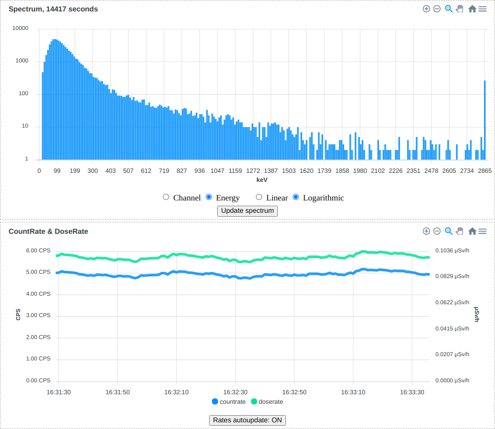

# RadiaCode Python Library — with macOS BLE support

[](https://pypi.org/project/radiacode)
[](https://www.python.org/downloads/)
[](https://opensource.org/licenses/MIT)

[Русская версия / Russian README](README.ru.md)

Python library for interfacing with the [RadiaCode-10x](https://www.radiacode.com/) radiation detectors and spectrometers. Control your device, collect measurements, and analyze radiation data with ease.

**This is a fork of [cdump/radiacode](https://github.com/cdump/radiacode) with Bluetooth support added for macOS and Windows.**

## Why this fork?

The upstream library uses [bluepy](https://github.com/IanHarvey/bluepy) for
Bluetooth Low Energy (BLE) connectivity.  **bluepy only works on Linux** — it
calls into the Linux BlueZ D-Bus API directly and has no macOS or Windows
backend.  On macOS, the upstream library simply raises
`ConnectionClosed("Bluetooth is not supported on this platform")` and falls back
to USB.

**The fix:** replace the Darwin stub with
[bleak](https://github.com/hbldh/bleak), a cross-platform async BLE library
that uses **CoreBluetooth** on macOS, **WinRT** on Windows, and **BlueZ** on
Linux.  Because `bleak` is async and the public `RadiaCode` API is synchronous,
the implementation wraps `bleak` in a dedicated daemon thread with its own
`asyncio` event loop — callers see no difference.

An additional macOS constraint: **CoreBluetooth does not expose MAC addresses**
of BLE peripherals.  Device discovery therefore works via a BLE scan filtered
by the RadiaCode service UUID (`e63215e5-…`) or device name prefix, with an
optional `bluetooth_address` parameter for the CoreBluetooth-assigned UUID.

The bleak transport was validated with a 6-hour soak test on RC-101 firmware
4.14 before being merged; validation scripts live in `phase0/`.

## Features

- Real-time radiation measurements
- Spectrum acquisition and analysis
- USB and Bluetooth connectivity (macOS, Linux, Windows)
- Web interface example included
- Device configuration management

## Demo

Interactive web interface example ([backend](src/radiacode/examples/webserver.py) | [frontend](src/radiacode/examples/webserver.html)):



## Quick Start

### Install

```bash
pip install --upgrade radiacode
# or, with example dependencies:
pip install --upgrade 'radiacode[examples]'
```

### Examples

```bash
# USB connection (all platforms)
python3 -m radiacode.examples.basic

# Bluetooth — macOS / Windows (via bleak, no sudo)
python3 -m radiacode.examples.basic --bluetooth-name RadiaCode

# Bluetooth — Linux (via bluepy, replace MAC)
python3 -m radiacode.examples.basic --bluetooth-mac 52:43:01:02:03:04

# Web interface (USB)
python3 -m radiacode.examples.webserver
# Web interface (Bluetooth, macOS)
python3 -m radiacode.examples.webserver --bluetooth-name RadiaCode
```

### Library Usage

```python
from radiacode import RadiaCode, RealTimeData

# Connect to device (USB by default)
device = RadiaCode()

# Get current radiation measurements
data = device.data_buf()
for record in data:
    if isinstance(record, RealTimeData):
        print(f"Dose rate: {record.dose_rate}")

# Get spectrum data
spectrum = device.spectrum()
print(f"Live time: {spectrum.duration}s")
print(f"Total counts: {sum(spectrum.counts)}")

# Configure device
device.set_display_brightness(5)  # 0-9 brightness level
device.set_language('en')         # 'en' or 'ru'
```

#### Bluetooth Connection

```python
# macOS / Windows — auto-scan for any RadiaCode device
device = RadiaCode(bluetooth_name='RadiaCode')

# macOS — connect by CoreBluetooth UUID (discovered once via bleak/scan)
device = RadiaCode(bluetooth_address='XXXXXXXX-XXXX-XXXX-XXXX-XXXXXXXXXXXX')

# Linux — connect by MAC address (via bluepy)
device = RadiaCode(bluetooth_mac='52:43:01:02:03:04')

# USB — connect to specific device by serial number
device = RadiaCode(serial_number='RC-101-xxxxxx')
```

#### More Features

```python
# Energy calibration
coefficients = device.energy_calib()
print(f"Calibration coefficients: {coefficients}")

# Reset accumulated data
device.dose_reset()
device.spectrum_reset()

# Configure device behaviour
device.set_sound_on(True)
device.set_vibro_on(True)
device.set_display_off_time(30)  # Auto-off after 30 seconds
```

## Development Setup

1. Install prerequisites:

   ```bash
   curl -LsSf https://astral.sh/uv/install.sh | sh
   ```

2. Clone this repository:

   ```bash
   git clone https://github.com/Steaeavean/radiacode_stuff.git
   cd radiacode_stuff
   ```

3. Run examples:

   ```bash
   uv run python -m radiacode.examples.basic
   ```

## Platform-Specific Notes

### macOS

- USB connectivity works out of the box.
- Bluetooth (BLE) is **fully supported** via [bleak](https://github.com/hbldh/bleak) (CoreBluetooth). No sudo required.
- Required: `brew install libusb`

**Connecting via BLE on macOS:**

CoreBluetooth does not expose raw MAC addresses. Use one of:

```bash
# Auto-scan — finds any nearby RadiaCode device
python3 -m radiacode.examples.basic --bluetooth-name RadiaCode

# Specific device by CoreBluetooth UUID (stable across sessions once paired)
python3 -m radiacode.examples.basic --bluetooth-address XXXXXXXX-XXXX-XXXX-XXXX-XXXXXXXXXXXX
```

To discover the CoreBluetooth UUID of your device, run a quick scan:

```python
import asyncio
from bleak import BleakScanner

async def scan():
    devices = await BleakScanner.discover(timeout=5)
    for d in devices:
        if 'RadiaCode' in (d.name or ''):
            print(d.address, d.name)

asyncio.run(scan())
```

### Linux

- Both USB and Bluetooth are fully supported.
- USB: may need [udev rules](radiacode.rules) for non-root access.
- Bluetooth (BLE): uses [bluepy](https://github.com/IanHarvey/bluepy) (`bluetooth_mac=`).
  Requires Bluetooth libraries (`sudo apt install libbluetooth-dev`) and usually root.

### Windows

- USB connectivity supported.
- Bluetooth (BLE) supported via [bleak](https://github.com/hbldh/bleak). Use `bluetooth_name` or `bluetooth_address`.
- Required: USB drivers (WinUSB via Zadig, or the vendor driver).

## Migration from `bluetooth_mac` (Linux/bluepy) to `bluetooth_name` (macOS/bleak)

| Old (Linux, bluepy) | New (macOS/Windows, bleak) |
|---|---|
| `RadiaCode(bluetooth_mac='AA:BB:CC...')` | `RadiaCode(bluetooth_name='RadiaCode')` |
| `--bluetooth-mac AA:BB:CC...` | `--bluetooth-name RadiaCode` |

The public `RadiaCode` API (all methods beyond the constructor) is identical regardless of transport.

## Utilities

### `timesync.py` — Sync device clock to system time

The library automatically calls `set_local_time(now)` on every connect, but
`timesync.py` makes the sync explicit and confirms it with a drift report.

**When to use:** if the device display shows UTC instead of local time (typical
after the official RadiaCode Android app last connected — it sets UTC).

```bash
# Auto-scan (any nearby RadiaCode):
uv run python timesync.py

# Fastest — connect by known CoreBluetooth UUID:
uv run python timesync.py --bluetooth-address XXXXXXXX-XXXX-XXXX-XXXX-XXXXXXXXXXXX

# Report drift only, do not sync:
uv run python timesync.py --dry-run
```

See [docs/TIMESYNC.md](docs/TIMESYNC.md) for cron setup and technical details.

## Phase 0 Validation Scripts

The `phase0/` directory contains BLE validation scripts that were used to verify
the wire protocol on macOS before the bleak transport was integrated into the library.
They remain useful for low-level debugging, hypothesis testing, and soak runs:

| Script | Purpose |
|---|---|
| `ble_transport.py` | Async bleak transport + command layer (reference implementation) |
| `ble_soak.py` | Multi-hour BLE soak logger (reconnect / idle cycles) |
| `analyze_soak.py` | Offline report generator for soak logs |
| `busy_probe.py` | H5/H21: connectable flag & busy/free state |
| `h16_search_probe.py` | H16/H17: RealTimeData / RareData cadence |
| `dose_compare.py` | H18: dose accumulation comparison |
| `spectrum_probe.py` | H20: spectrum via BLE |
| `h14_buffer_depth.py` | H14: DATA_BUF depth (USB, requires sudo) |
| `h15_reconnect.py` | H15: reconnect state preservation (USB) |

Running phase0 scripts:

```bash
cd phase0
uv sync          # installs bleak + in-repo radiacode
caffeinate -is uv run python ble_soak.py --hours 1
```

## License

This project is licensed under the MIT License — see the [LICENSE](LICENSE) file for details.
